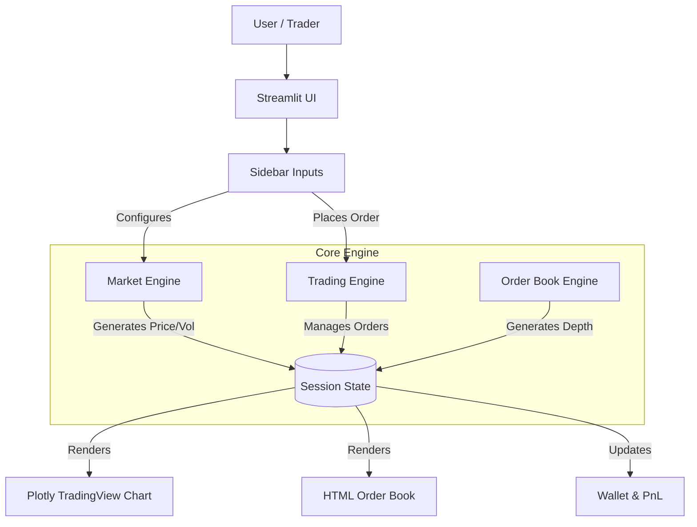

# GBM-Market-Engine
# GBM-Market-Engine: High-Fidelity Market Simulator

**GBM-Market-Engine** is a professional-grade, interactive market simulation engine built with Python and Streamlit. It replicates the complex microstructure of a financial exchange, featuring realistic price action driven by stochastic calculus, an organic order book, and TradingView-style high-performance visualizations.


---

## 🚀 Key Features

- **Geometric Brownian Motion (GBM)**: Precise price discovery based on stochastic differential equations (SDEs) tailored for high-volatility assets.
- **Jump-Diffusion Model**: Simulates realistic "Flash Crashes" and momentum "Pumps" with configurable jump intensity and standard deviation.
- **TradingView Aesthetics**: A stunning, high-performance charting interface with specialized colors (Emerald Green/Rose Red), thin-wick candlesticks, and a unified crosshair.
- **Full-Screen Chart Mode**: Toggle between a standard split-view and a maximized, full-width chart for professional analysis.
- **Dynamic Volatility Logic**: Real-time volatility scaling where upward momentum increases variance, simulating FOMO and market panic.
- **Live Order Book & Trades**: A synthesized L2 order book and trade tape showing real-time market depth and aggressive orders.
- **Futures Trading Engine**: Full paper trading support for **Long/Short** positions, **Isolated/Cross** margin modes, and real-time **Liquidation** logic based on Maintenance Margin Requirements (MMR).

---

## 🖥️ User Interface & Experience

The application is designed to feel like a professional CEX (Centralized Exchange) trading terminal.

### 📊 Professional Charting
- **OHLC Candlesticks**: High-fidelity Japanese candlesticks with configurable Moving Averages (SMA).
- **Volume Profiling**: Color-coded volume bars showing buying vs. selling pressure per tick.
- **Customizable Indicators**: Quickly toggle between different SMA periods directly from the sidebar.

### ⚡ Trading Dashboard
- **Market Settings**: Control the drift, base volatility, and symbol names (e.g., XYZ, BTC, AAPL) on the fly.
- **Order Entry**: Advanced order entry with leverage (up to 50x) and automatic margin calculation.

---

## 🏗️ Architecture & Mathematics

### 📐 Price Engine SDE
The core price movement is driven by a stochastic process:

$$
dS_t = \mu S_t dt + \sigma S_t dW_t + S_t dJ_t
$$

Where:
- $S_t$: Asset Price
- $\mu$: Drift (Trend)
- $\sigma$: Volatility (Variance)
- $dW_t$: Wiener Process (Brownian Motion)
- $dJ_t$: Jump Process (Poisson-driven shocks)

### 🏗️ Workflow
The system uses a modular, state-driven architecture for real-time reactivity:



---

## 📦 Getting Started

### 1. Installation
```bash
cd GBM-Market-Engine
pip install -r requirements.txt
```

### 2. Run the Engine
```bash
streamlit run simulator.py
```

---
