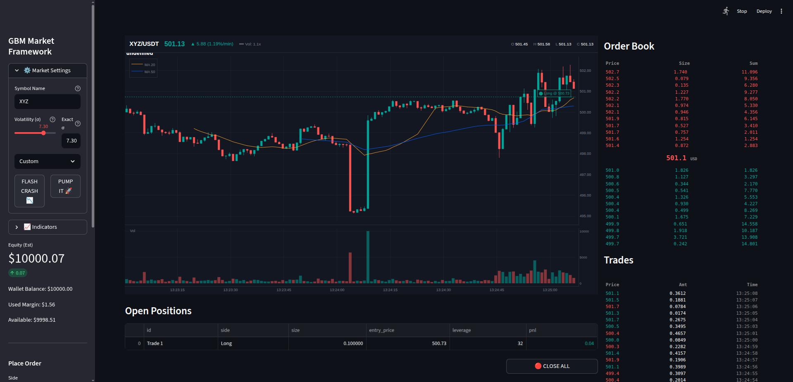
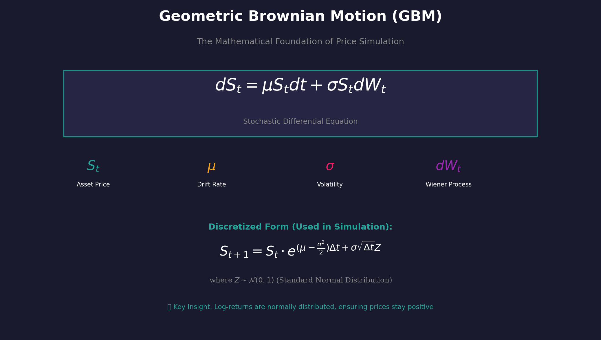
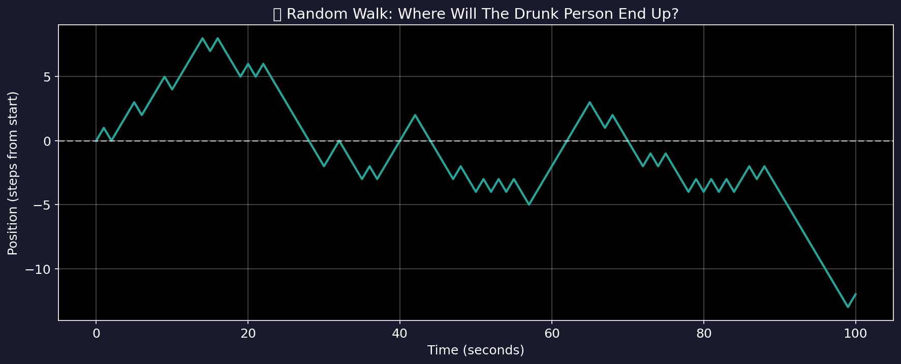
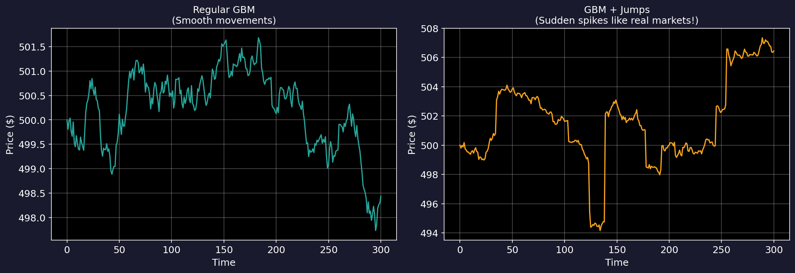
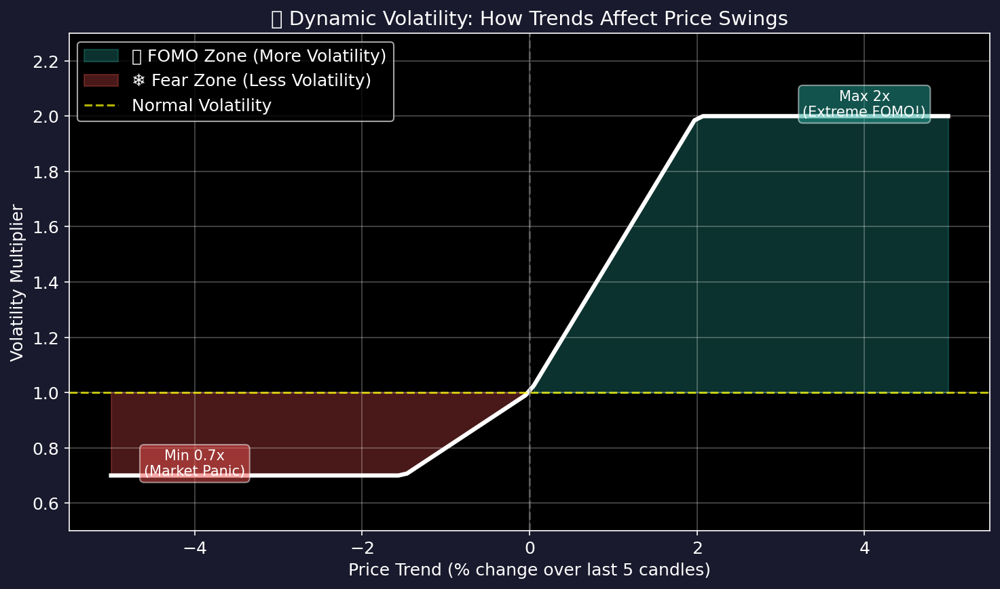
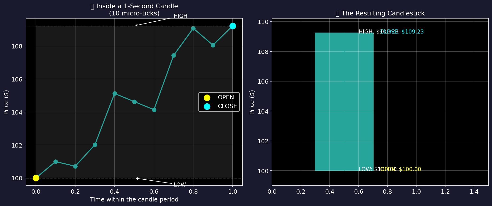
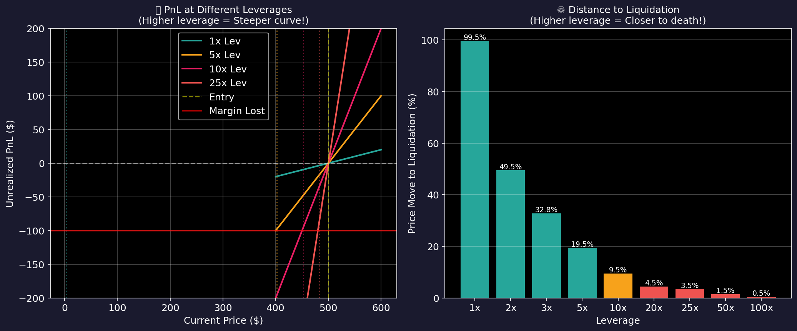
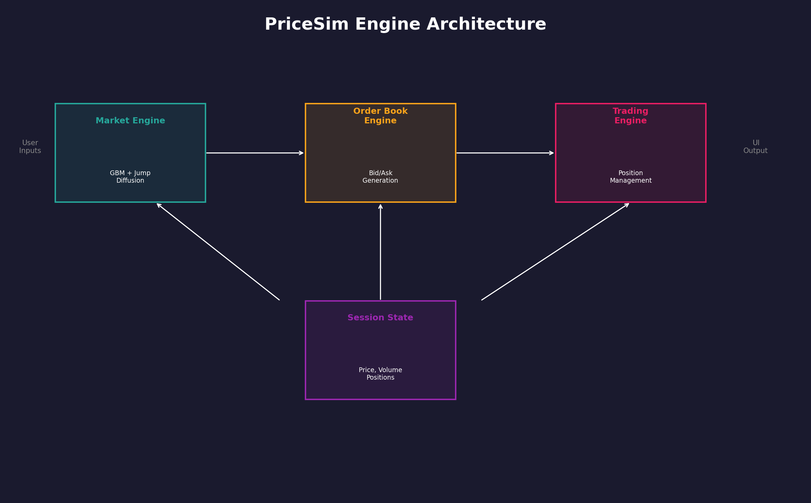

<div align="center">

# 📈 GBM Market Framework

### Real-Time Market Microstructure Simulation Engine

[](https://python.org)
[](https://streamlit.io)
[](LICENSE)
[]()


</div>

---

## 🎯 Project Overview

**GBM Market Framework** is an advanced market microstructure simulation platform that replicates the dynamics of crypto and equity exchanges with mathematical precision. Built on the foundation of **Geometric Brownian Motion (GBM)** enhanced with **Merton's Jump-Diffusion** model, GBM Market Framework provides researchers and practitioners with a realistic environment for studying price dynamics, market behavior, and trading strategies.

This project demonstrates the practical application of stochastic calculus in financial modeling, combining theoretical rigor with an intuitive, professional-grade user interface.

<div align="center">


*Figure 1: GBM Market Framework Trading Interface — Real-time candlestick charts, order book depth, and trade history*

</div>

---

## ✨ Key Features

| Feature | Description |
|---------|-------------|
| **Stochastic Price Engine** | GBM with configurable drift (μ) and volatility (σ) parameters |
| **Jump-Diffusion Model** | Simulates sudden market shocks with Poisson-distributed jumps |
| **Dynamic Volatility** | Trend-responsive volatility multiplier (0.7x - 2.0x) |
| **Order Book Synthesis** | Real-time bid/ask depth generation based on market conditions |
| **Trading Simulation** | Full paper trading with Long/Short positions, leverage (1x-100x), and liquidation mechanics |
| **Professional UI** | TradingView-inspired charts with moving averages and volume analysis |

---

## 📊 Mathematical Foundation

### Geometric Brownian Motion (GBM)

The core price dynamics follow the Geometric Brownian Motion model, defined by the stochastic differential equation:

<div align="center">

$$dS_t = \mu S_t \, dt + \sigma S_t \, dW_t$$

</div>

Where:
- **S_t** — Asset price at time t
- **μ** — Drift coefficient (expected return rate)
- **σ** — Volatility coefficient (standard deviation of returns)
- **dW_t** — Wiener process (Brownian motion increment)


*Figure 2: Mathematical decomposition of the GBM stochastic process*

### Discretized Implementation

For numerical simulation, we apply the Exact Solution (Log-normal step):

$$S_{t+\Delta t} = S_t \cdot \exp\left[\left(\mu - \frac{\sigma^2}{2}\right)\Delta t + \sigma\sqrt{\Delta t}\, Z\right]$$

Where **Z ~ N(0,1)** is a standard normal random variable. This ensures log-normally distributed prices and guaranteed positive values.

**Note: We use the exponential function (`exp`) to prevent prices from ever dropping below zero and to ensure the results follow a log-normal distribution.
---

## 🔬 Simulation Components

### 1. Random Walk Foundation

Every price simulation begins with the fundamental concept of random walks. Like a particle undergoing Brownian motion, prices evolve through the accumulation of random shocks.


*Figure 3: Visualization of a symmetric random walk — the conceptual foundation of stochastic price models*

### 2. Multiple Price Path Scenarios

Due to the stochastic nature of the model, identical parameters produce divergent outcomes. This ensemble behavior is critical for risk assessment and Monte Carlo applications.


*Figure 4: Five independent GBM realizations from identical initial conditions — demonstrating path-dependent uncertainty*

### 3. Jump-Diffusion Extension (Merton Model)

To capture discontinuous price movements (flash crashes, earning announcements, black swan events), we incorporate Merton's jump-diffusion model:

$$dS_t = \mu S_t \, dt + \sigma S_t \, dW_t + S_t \, dJ_t$$

Where **J_t** is a compound Poisson process with intensity λ and normally-distributed jump sizes.


*Figure 5: Comparative analysis — Pure GBM (left) versus Jump-Diffusion enhanced model (right)*

**Implementation Parameters:**
| Parameter | Value | Description |
|-----------|-------|-------------|
| λ (Jump Intensity) | 5% per tick | Probability of jump occurrence |
| Jump Size μ | 0 | Mean jump magnitude (symmetric) |
| Jump Size σ | 0.5% | Standard deviation of jump sizes |

### 4. Dynamic Volatility Adjustment

Real markets exhibit volatility clustering — periods of high volatility tend to persist. GBM Market Framework implements a trend-responsive volatility multiplier:

$$\sigma_{effective} = \sigma_{base} \times f(\text{trend})$$

Where f(trend) ranges from 0.7 (bearish dampening) to 2.0 (bullish amplification).


*Figure 6: Volatility response function — Uptrends amplify volatility (FOMO effect), downtrends moderate it*

### 5. OHLC Candlestick Generation

Each candlestick encapsulates the price action within a time period through sub-tick simulation:

1. **Open** — Previous candle's close
2. **High/Low** — Extrema of N micro-ticks (N=10)
3. **Close** — Final micro-tick value
4. **Volume** — Derived from price range magnitude


*Figure 7: Micro-tick simulation within a candlestick period — 10 internal samples define OHLC values*

---

## 💹 Trading Mechanics

### Leverage and Liquidation

GBM Market Framework implements exchange-accurate leverage mechanics with maintenance margin requirements.

**Liquidation Price Calculation:**

| Position | Formula |
|----------|---------|
| **Long** | $P_{liq} = P_{entry} \times \left(1 - \frac{1}{\text{Leverage}} + \text{MMR}\right)$ |
| **Short** | $P_{liq} = P_{entry} \times \left(1 + \frac{1}{\text{Leverage}} - \text{MMR}\right)$ |

Where **MMR = 0.5%** (Maintenance Margin Rate)


*Figure 8: PnL curves at various leverage levels (left) and liquidation distance analysis (right)*

---

## 🏗️ System Architecture

GBM Market Framework employs a modular, state-driven architecture optimized for real-time simulation.



### Component Responsibilities

| Component | Function |
|-----------|----------|
| **MarketEngine** | Computes next price tick S(t+1) using GBM + Jump-Diffusion |
| **OrderBookEngine** | Generates realistic bid/ask depth based on price and volatility |
| **TradingEngine** | Manages portfolio, calculates PnL, executes liquidations |
| **SessionState** | Centralized state management via Streamlit session |

---

## 🚀 Installation & Usage

### Prerequisites
- Python 3.10 or higher
- pip package manager

### Quick Start

```bash
# Clone the repository
git clone https://github.com/Twobalance/GBM-Market-Framework.git
cd GBM-Market-Framework

# Create virtual environment
python3 -m venv .venv
source .venv/bin/activate  # Linux/Mac
# or: .venv\Scripts\activate  # Windows

# Install dependencies
pip install -r requirements.txt

# Launch the simulator
streamlit run simulator.py
```

### Dependencies

```
streamlit>=1.28.0
pandas>=2.0.0
numpy>=1.24.0
plotly>=5.15.0
```

---


</div>
